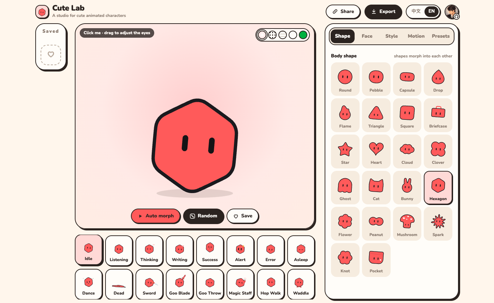
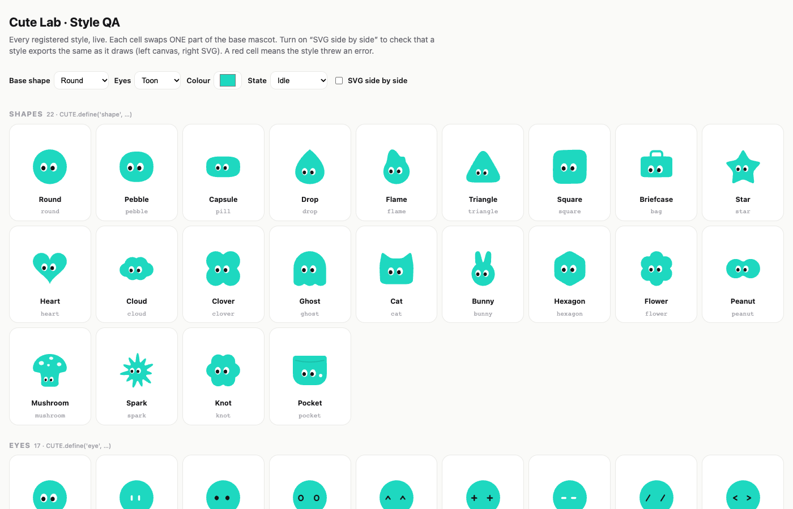

# Cute Lab

**會動的可愛角色工作室** — *a tiny studio for animated, cute mascots.*

Pick a body shape, a face, a finish and an accessory, press a state (thinking, typing, success, sleeping,
sword swing…) and export it as **animated SVG, PNG, GIF or a ZIP** of every state. Everything is drawn from
maths — no image assets, no build step, no dependencies.

Built with Claude Opus as a pair: the engine, every shape, face and animation is code.

**Try it:** https://charonyuu.github.io/cute-lab/ · **Style QA wall:** [lab.html](https://charonyuu.github.io/cute-lab/lab.html) · [中文說明](#中文說明)



## Features

- **Shapes** generated from maths (super-ellipses, rounded polygons, blob unions…), morphing smoothly into each other
- **Faces**: eyes, brows, mouths, cheeks — eyes follow the cursor, blink, react to clicks
- **Finishes and accessories**: flat, glossy, sticker, outline; antenna, sprout, crown, bow, halo, headphones
- **States / actions**: idle, listening, thinking, typing, success, error, sleeping, dancing, melting, sword swing, wand, walking…
- **Export**: animated SVG (a fake canvas records the drawing calls and turns them into SVG), PNG, GIF, ZIP of all states
- **Share links**: the whole character fits in the URL hash; random button, presets, a saved "team"
- **中文 / English**: switch in the top-right corner (defaults to your browser language)

## Run

Plain `<script src>` files — open `index.html` directly, or serve the folder:

```bash
python3 -m http.server 8765   # http://localhost:8765/ and /lab.html
```

`node scripts/prepare-site.mjs` syntax-checks every script, checks every local reference exists and copies the site
to `dist/` (what the GitHub Pages workflow publishes). Any static host works: GitHub Pages, Cloudflare Pages,
Netlify, Vercel.

## Add a style

Engine + style plug-ins. A new shape, eye, mouth, finish, accessory or action is **one object and one
`CUTE.define()` call** in `styles/*.js`; the menus, randomiser, presets, share links and every export pick it up
automatically.

```
index.html / app.js   UI, generated entirely from the registry
i18n.js               中文 / English: the Chinese text is the key, T('分享') → 'Share'
lab.html              QA wall: every registered style in its own cell, canvas vs. SVG side by side
engine/kit.js         registry, maths, drawing primitives, animation helpers
engine/render.js      drawBlob(): description + animation frame → drawing; share-token encode/decode
engine/export.js      SvgCtx (fake canvas → SVG), animated SVG, GIF, ZIP
styles/*.js           ← the styles
```

The full design notes — coordinate systems, the style interfaces, what the SVG exporter supports, a 5-minute
"new style" checklist and the change log — are in **[PLAYBOOK.md](PLAYBOOK.md)** (中文).



## Licence

[MIT](LICENSE). The Nunito font is loaded from Google Fonts (SIL Open Font License).

---

## 中文說明

Cute Lab 是一個做「會動的可愛角色」的小工作室，引擎和所有形狀、臉、動作都是和 Claude Opus 一起用程式寫出來的，沒有任何圖片素材。

- 選形狀、臉、風格、配件，按一個狀態（思考、打字、成功、睡覺、揮劍……），角色就會動起來。
- 可以匯出動態 SVG、PNG、GIF，或把所有狀態打包成 ZIP。
- 整個角色會存在網址裡，複製連結就能分享。
- 右上角可以切換中文 / English，預設跟著瀏覽器語言。

**本地執行**：直接打開 `index.html`，或在資料夾裡執行 `python3 -m http.server 8765`。

**新增樣式**：在 `styles/*.js` 寫一個物件、呼叫一次 `CUTE.define()`，選單、隨機、預設、分享連結和所有匯出格式都會自動支援。詳細做法在 [PLAYBOOK.md](PLAYBOOK.md)。

**授權**：MIT。
